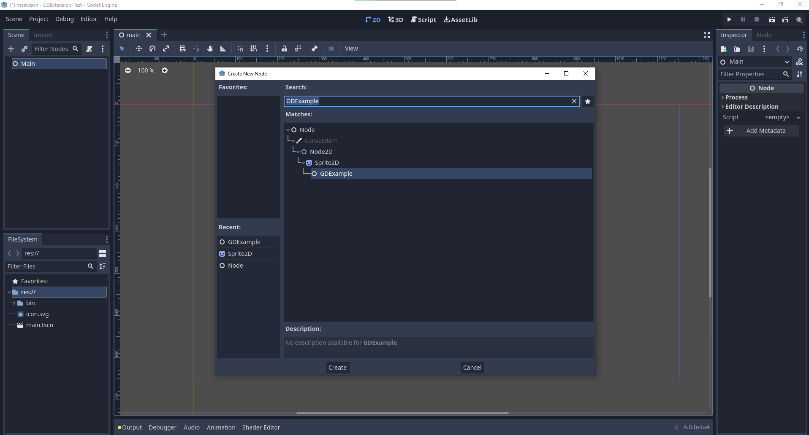

.. _doc_gdextension_cpp_example:

GDExtension C++ example
====================

Introduction
------------

The C++ bindings for GDExtension are built on top of the C GDExtension API
and provide a nicer way to "extend" nodes in Godot using C++. This new system allows the 
extension of Godot to nearly the same level as statically linked C++ modules.

You can download the included example in the test folder of the godot-cpp repository `on
GitHub <https://github.com/godotengine/godot-cpp>`__.

Setting up the project
----------------------

There are a few prerequisites you'll need:

- a Godot 4.x executable,
- a C++ compiler,
- SCons as a build tool,
- a copy of the `godot-cpp
  repository <https://github.com/godotengine/godot-cpp>`__.

See also :ref:`Compiling <toc-devel-compiling>` as the build tools are identical
to the ones you need to compile Godot from source.

You can download these repositories from GitHub or let Git do the work for you.
Note that these repositories have different branches for different versions
of Godot. GDExtension modules written will not work in older versions of Godot (3.x) 
and vice versa, so make sure you download the correct branch.

.. note::

    `GDExtension <https://godotengine.org/article/introducing-gd-extensions>`__
    has been merged in the ``master`` branch of godot-cpp,
    but it is only compatible with the upcoming Godot 4.0.
    Therefore, you need to use the ``master`` branch of godot-cpp to use GDExtension
    and follow this example.

If you are versioning your project using Git, it is a good idea to add them as
Git submodules:

.. code-block:: none

    mkdir gdextension_cpp_example
    cd gdextension_cpp_example
    git init
    git submodule add -b master https://github.com/godotengine/godot-cpp
    cd godot-cpp
    git submodule update --init

If you decide to just download the repositories or clone them into your project
folder, make sure to keep the folder layout identical to the one described here,
as much of the code we'll be showcasing here assumes the project follows this
layout.

Do make sure you clone recursive to pull in both repositories:

.. code-block:: none

    mkdir gdextension_cpp_example
    cd gdextension_cpp_example
    git clone --recursive -b master https://github.com/godotengine/godot-cpp

.. note::

    ``godot-cpp`` now includes ``godot-headers`` as a nested submodule, if you've
    manually downloaded them please make sure to place ``godot-headers`` inside
    of the ``godot-cpp`` folder.

    You don't have to do it this way, but we've found it easiest to manage. If you
    decide to download the repositories or clone them into your folder,
    make sure to keep the folder layout the same as we've setup here. Much of
    the code we'll be showcasing here assumes the project has this layout.

If you cloned the example from the link specified in the introduction, the
submodules are not automatically initialized. You will need to execute the
following commands:

.. code-block:: none

    cd gdextension_cpp_example
    git submodule update --init --recursive

This will clone these two repositories into your project folder.

Building the C++ bindings
-------------------------

Now that we've downloaded our prerequisites, it is time to build the C++
bindings.

The repository contains a copy of the metadata for the current Godot release,
but if you need to build these bindings for a newer version of Godot, simply
call the Godot executable:

.. code-block:: none

    godot --dump-extension-api extension_api.json

Place the resulting ``extension_api.json`` file in the project folder and add
``custom_api_file=<PATH_TO_FILE>`` to the scons command
below.

To generate and compile the bindings, use this command (replacing ``<platform>``
with ``windows``, ``linux`` or ``macos`` depending on your OS):

To speed up compilation, add `-jN` at the end of the SCons command line where `N`
is the number of CPU threads you have on your system. The example below uses 4 threads.

.. code-block:: none

    cd godot-cpp
    scons platform=<platform> -j4
    cd ..

This step will take a while. When it is completed, you should have static
libraries that can be compiled into your project stored in ``godot-cpp/bin/``.

.. note::

    You may need to add ``bits=64`` to the command on Windows or Linux.

Creating a simple plugin
------------------------

Now it's time to build an actual plugin. We'll start by creating an empty Godot
project in which we'll place a few files.

Open Godot and create a new project. For this example, we will place it in a
folder called ``demo`` inside our GDExtension module's folder structure.

In our demo project, we'll create a scene containing a Node called "Main" and
we'll save it as ``main.tscn``. We'll come back to that later.

Back in the top-level GDExtension module folder, we're also going to create a
subfolder called ``src`` in which we'll place our source files.

You should now have ``demo``, ``godot-cpp``, and ``src``
directories in your GDExtension module.

Your folder structure should now look like this:

.. code-block:: md
    gdextension_cpp_example/
    |
    +--demo/                  # game example/demo to test the extension
    |
    +--godot-cpp/             # C++ bindings
    |
    +--src/                   # source code of the extension we are building

In the ``src`` folder, we'll start with creating our header file for the
GDExtension node we'll be creating. We will name it ``gdexample.h``:

.. code-block:: C++

    #ifndef GDEXAMPLE_H
    #define GDEXAMPLE_H

    #include <godot_cpp/classes/sprite2d.hpp>

    namespace godot {

    class GDExample : public Sprite2D {
        GDCLASS(GDExample, Sprite2D)

    private:
        float time_passed;

    protected:
        static void _bind_methods();

    public:
        GDExample();
        ~GDExample();

        void _init(); // our initializer called by Godot

        void _process(float delta);
    };

    }

    #endif

There are a few things of note to the above. We include ``sprite2d.hpp`` which
contains bindings to the Sprite2D class. We'll be extending this class in our
module.

We're using the namespace ``godot``, since everything in GDExtension is defined
within this namespace.

Then we have our class definition, which inherits from our Sprite2D through a
container class. We'll see a few side effects of this later on. The
``GDCLASS`` macro sets up a few internal things for us.

After that, we declare a single member variable called ``time_passed``.

In the next block we're defining our methods, we obviously have our constructor
and destructor defined, but there are two other functions that will likely look
familiar to some, and one new method.

The first is ``_bind_methods``, which is a static function that Godot will
call to find out which methods can be called and which properties it exposes. 
The second is our ``_process`` function, which will work exactly the same 
as the ``_process`` function you're used to in GDScript. The third is 
our ``_init`` function which is called after Godot has properly set up
our object.

Let's implement our functions by creating our ``gdexample.cpp`` file:

.. code-block:: C++

    #include "gdexample.h"
    #include <godot_cpp/core/class_db.hpp>

    using namespace godot;

    void GDExample::_bind_methods() {
        ClassDB::bind_method(D_METHOD("_process"), &GDExample::_process);
    }

    GDExample::GDExample() {
        // initialize any variables here
        time_passed = 0.0;
    }

    GDExample::~GDExample() {
        // add your cleanup here
    }

    void GDExample::_process(float delta) {
        time_passed += delta;

        Vector2 new_position = Vector2(10.0 + (10.0 * sin(time_passed * 2.0)), 10.0 + (10.0 * cos(time_passed * 1.5)));

        set_position(new_position);
    }

This one should be straightforward. We're implementing each method of our class
that we defined in our header file.

Note our ``_process`` function, which keeps track of how much time has passed
and calculates a new position for our sprite using a sine and cosine function.
What stands out is calling ``owner->set_position`` to call one of the built-in
methods of our Sprite2D. This is because our class is a container
class; ``owner`` points to the actual Sprite2D node our script relates to.

There is one more C++ file we need; we'll name it ``register_types.cpp``. Our
GDExtension plugin can contain multiple classes, each with their own header
and source file like we've implemented ``GDExample`` up above. What we need now
is a small bit of code that tells Godot about all the classes in our
GDExtension plugin.

.. code-block:: C++

    #include "register_types.h"

    #include "gdexample.h"

    #include <godot/gdnative_interface.h>
    #include <godot_cpp/core/defs.hpp>
    #include <godot_cpp/core/class_db.hpp>
    #include <godot_cpp/godot.hpp>

    using namespace godot;

    void initialize_example_module(ModuleInitializationLevel p_level) {
        if (p_level != MODULE_INITIALIZATION_LEVEL_SCENE) {
            return;
        }

        ClassDB::register_class<GDExample>();
    }

    void uninitialize_example_module(ModuleInitializationLevel p_level) {
        if (p_level != MODULE_INITIALIZATION_LEVEL_SCENE) {
            return;
        }
    }

    extern "C" {
    // Initialization.
    GDNativeBool GDN_EXPORT example_library_init(const GDNativeInterface *p_interface, const GDNativeExtensionClassLibraryPtr p_library, GDNativeInitialization *r_initialization) {
        godot::GDExtensionBinding::InitObject init_obj(p_interface, p_library, r_initialization);

        init_obj.register_initializer(initialize_example_module);
        init_obj.register_terminator(uninitialize_example_module);
        init_obj.set_minimum_library_initialization_level(MODULE_INITIALIZATION_LEVEL_SCENE);

        return init_obj.init();
    }
    }

The ``initialize_example_module`` and ``uninitialize_example_module`` functions get
called respectively when Godot loads our plugin and when it unloads it. All
we're doing here is parse through the functions in our bindings module to
initialize them, but you might have to set up more things depending on your
needs.

TODO:
The important function is the third function called ``example_library_init``.
We first call a function in our bindings library that does its usual stuff.
After that, we call the function ``register_class`` for each of our classes in
our library.

At last, we need the header file for the ``register_types.cpp`` named
``register_types.h``.

.. code-block:: C++

    #ifndef GDEXAMPLE_REGISTER_TYPES_H
    #define GDEXAMPLE_REGISTER_TYPES_H

    void initialize_example_module();
    void uninitialize_example_module();

    #endif // GDEXAMPLE_REGISTER_TYPES_H

Compiling the plugin
--------------------

We cannot easily write by hand a ``SConstruct`` file that SCons would use for
building. For the purpose of this example, just use
:download:`this hardcoded SConstruct file <files/cpp_example/SConstruct>` we've
prepared. We'll cover a more customizable, detailed example on how to use these
build files in a subsequent tutorial.

.. note::

    This ``SConstruct`` file was written to be used with the latest ``godot-cpp``
    master, you may need to make small changes using it with older versions or
    refer to the ``SConstruct`` file in the Godot 4.0 documentation.

Once you've downloaded the ``SConstruct`` file, place it in your GDExtension module
folder besides ``godot-cpp``, ``src`` and ``demo``, then run:

.. code-block:: none

    scons platform=<platform>

You should now be able to find the module in ``demo/bin/<platform>``.

.. note::

    Here, we've compiled both godot-cpp and our gdexample library as debug
    builds. For optimized builds, you should compile them using the
    ``target=template_release`` switch.

Using the GDExtension module
-------------------------

Before we jump back into Godot, we need to create one more file in
``demo/bin/``.

This file lets Godot know what dynamic libraries should be
loaded for each platform and the entry function for the module. It is called ``gdexample.gdextension``.

.. code-block:: none

    [configuration]

    entry_symbol = "example_library_init"

    [libraries]

    linux.64="res://bin/linux/libgdexample.linux.64.so"
    windows.x86_64="res://bin/win64/libgdexample.windows.x86_64.dll"
    macos="res://bin/osx/libgdexample.macos.framework"

This file contains a ``configuration`` section that controls the entry function of the module.

The ``libraries`` section is the important bit: it tells Godot the location of the
dynamic library in the project's filesystem for each supported platform. It will
also result in *just* that file being exported when you export the project,
which means the data pack won't contain libraries that are incompatible with the
target platform.

Finally, the ``dependencies`` section allows you to name additional dynamic
libraries that should be included as well. This is important when your GDExtension
plugin implements someone else's library and requires you to supply a
third-party dynamic library with your project.

Here is another overview to check the correct file structure:

.. code-block:: md
    gdextension_cpp_example/
    |
    +--demo/                  # game example/demo to test the extension
    |   |
    |   +--bin/
    |       |
    |       +--gdexample.gdextension
    |
    +--godot-cpp/             # C++ bindings
    |
    +--src/                   # source code of the extension we are building
    |   |
    |   +--register_types.cpp
    |   +--register_types.h
    |   +--gdexample.cpp
    |   +--gdexample.h

Time to jump back into Godot. We load up the main scene we created way back in
the beginning and now add a newly available GDExample node to the scene:

We're going to assign the Godot logo to this node as our texture, disable the
``centered`` property:

.. image:: img/gdextension_cpp_sprite.png

We're finally ready to run the project:

.. image:: img/gdextension_cpp_animated.gif

Adding properties
-----------------

GDScript allows you to add properties to your script using the ``export``
keyword. In GDExtension you have to register the properties with a getter and
sett function or directly implement the ``_get_property_list``, ``_get`` and
``_set`` methods of an object (but that goes far beyond the scope of this
tutorial.

Lets add a property that allows us to control the amplitude of our wave.

In our ``gdexample.h`` file we need to add a member variable and getter and setter
functions:

.. code-block:: C++

    ...
    private:
        float time_passed;
        float amplitude;

    public:
        void set_amplitude(const float amplitude);
        float get_amplitude() const;
    ...

In our ``gdexample.cpp`` file we need to make a number of changes, we will only
show the methods we end up changing, don't remove the lines we're omitting:

.. code-block:: C++

    void GDExample::_bind_methods() {
        ClassDB::bind_method(D_METHOD("get_amplitude"), &GDExample::get_amplitude);
        ClassDB::bind_method(D_METHOD("set_amplitude", "p_amplitude"), &GDExample::set_amplitude);

        ClassDB::add_property("GDExample", PropertyInfo(Variant::FLOAT, "amplitude"), "set_amplitude", "get_amplitude");
    }

    void GDExample::GDExample() {
        // initialize any variables here
        time_passed = 0.0;
        amplitude = 10.0;
    }

    void GDExample::_process(float delta) {
        time_passed += delta;

        Vector2 new_position = Vector2(
            amplitude + (amplitude * sin(time_passed * 2.0)),
            amplitude + (amplitude * cos(time_passed * 1.5))
        );

        set_position(new_position);
    }

    void GDExample::set_amplitude(const float p_amplitude) {
        amplitude = p_amplitude;
    }

    float GDExample::get_amplitude() const {
        return amplitude;
    }

Once you compile the module with these changes in place, you will see that a
property has been added to our interface. You can now change this property and
when you run your project, you will see that our Godot icon travels along a
larger figure.

Let's do the same but for the speed of our animation and use a setter and getter
function. Our ``gdexample.h`` header file again only needs a few more lines of
code:

.. code-block:: C++

    ...
        float amplitude;
        float speed;
    ...
        void _process(float delta) override;
        void set_speed(float p_speed);
        float get_speed();
    ...

This requires a few more changes to our ``gdexample.cpp`` file, again we're only
showing the methods that have changed so don't remove anything we're omitting:

.. code-block:: C++

    void GDExample::_bind_methods() {
        ClassDB::bind_method(D_METHOD("get_speed"), &GDExample::get_speed);
        ClassDB::bind_method(D_METHOD("set_speed", "p_speed"), &GDExample::set_speed);
	    ClassDB::add_property("GDExample", PropertyInfo(Variant::FLOAT, "speed"), "set_speed", "get_speed");
    }

    void GDExample::GDExample() {
        // initialize any variables here
        time_passed = 0.0;
        amplitude = 10.0;
        speed = 1.0;
    }

    void GDExample::_process(float delta) {
        time_passed += speed * delta;

        Vector2 new_position = Vector2(
            amplitude + (amplitude * sin(time_passed * 2.0)),
            amplitude + (amplitude * cos(time_passed * 1.5))
        );

        set_position(new_position);
    }

    void GDExample::set_speed(float p_speed) {
        speed = p_speed;
    }

    float GDExample::get_speed() const {
        return speed;
    }

Now when the project is compiled, we'll see another property called speed.
Changing its value will make the animation go faster or slower.

.. note::

    For simplicity, we've left out the optional parameters in the
    add_property() method call. These parameters are
    ``hint``, ``hint_string``, ``usage`` and ``class_name``. These can be used to
    further configure how properties are displayed and set on the Godot side.

Signals
-------

Last but not least, signals fully work in GDExtension as well. Having your extension
react to a signal given out by another object requires you to call ``connect``
on that object. We can't think of a good example for our wobbling Godot icon, we
would need to showcase a far more complete example.

This is the required syntax:

.. code-block:: C++

    some_other_node->connect("the_signal", this, "my_method");

Note that you can only call ``my_method`` if you've previously registered it in
your ``_bind_methods`` method.

Having your object sending out signals is more common. For our wobbling
Godot icon, we'll do something silly just to show how it works. We're going to
emit a signal every time a second has passed and pass the new location along.

In our ``gdexample.h`` header file, we need to define a new member ``time_emit``:

.. code-block:: C++

    ...
        float time_passed;
        float time_emit;
        float amplitude;
    ...

This time, the changes in ``gdexample.cpp`` are more elaborate. First,
you'll need to set ``time_emit = 0.0;`` in either our ``_init`` method or in our
constructor. We'll look at the other 2 needed changes one by one.

In our ``_bind_methods`` method, we need to declare our signal. This is done
as follows:

.. code-block:: C++

    void GDExample::_bind_methods() {
        ClassDB::add_property("GDExample", PropertyInfo(Variant::FLOAT, "amplitude"), "set_amplitude", "get_amplitude");
        ClassDB::add_property("GDExample", PropertyInfo(Variant::FLOAT, "speed"), "set_speed", "get_speed");

        ADD_SIGNAL(MethodInfo("position_changed", PropertyInfo(Variant::OBJECT, "node"), PropertyInfo(Variant::VECTOR2, "new_pos")));
    }

Here, our ``ADD_SIGNAL`` method can be a single call first taking the
signals name, then having pairs of the type specifying the parameter name and
the value of each parameter we'll send along with this signal.

Next, we'll need to change our ``_process`` method:

.. code-block:: C++

    void GDExample::_process(float delta) {
        time_passed += speed * delta;

        Vector2 new_position = Vector2(
            amplitude + (amplitude * sin(time_passed * 2.0)),
            amplitude + (amplitude * cos(time_passed * 1.5))
        );

        set_position(new_position);

        time_emit += delta;
        if (time_emit > 1.0) {
            emit_signal("position_changed", this, new_position);

            time_emit = 0.0;
        }
    }

After a second has passed, we emit our signal and reset our counter. We can add
our parameter values directly to ``emit_signal``.

Once the GDExtension library is compiled, we can go into Godot and select our sprite
node. In the **Node** dock, we can find our new signal and link it up by pressing
the **Connect** button or double-clicking the signal. We've added a script on
our main node and implemented our signal like this:

.. code-block:: GDScript

    extends Node

    func _on_Sprite2D_position_changed(node, new_pos):
        print("The position of " + node.get_class() + " is now " + str(new_pos))

Every second, we output our position to the console.

Next steps
----------

We hope the above example showed you the basics. You can
build upon this example to create full-fledged scripts to control nodes in Godot
using C++.
